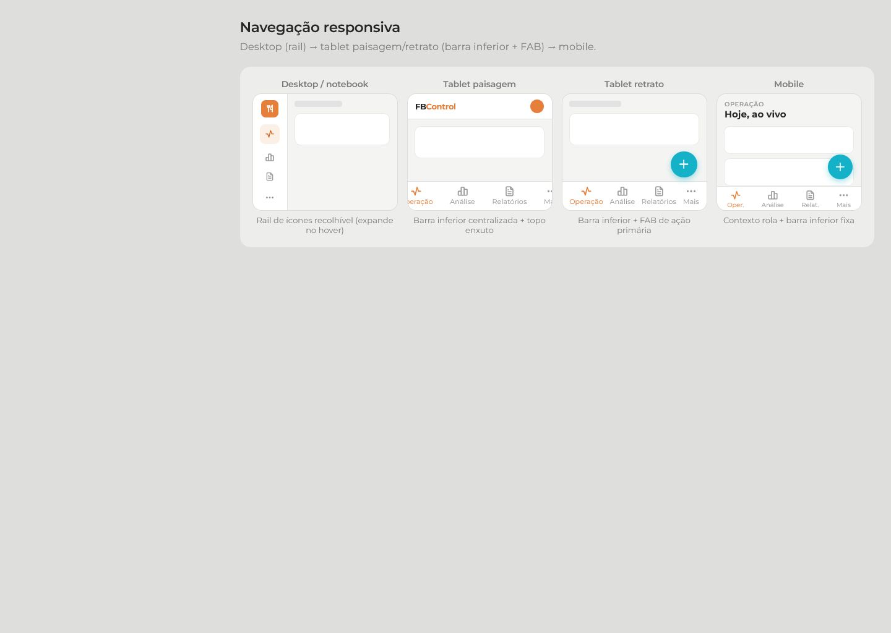
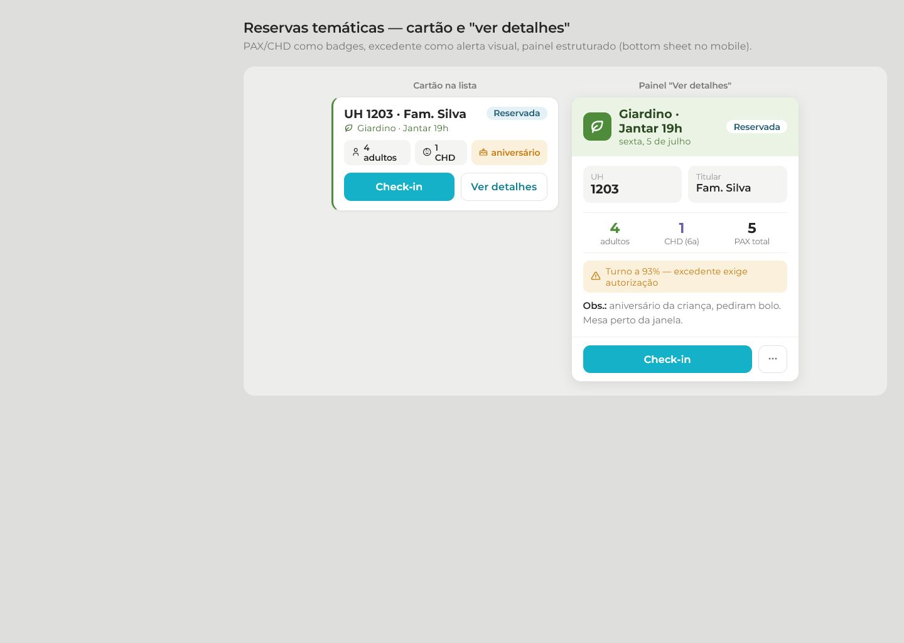
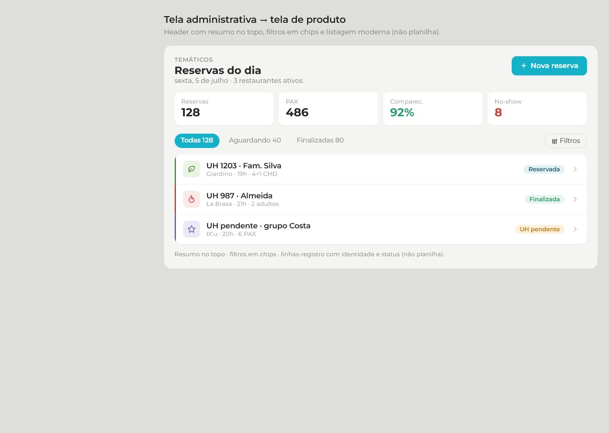
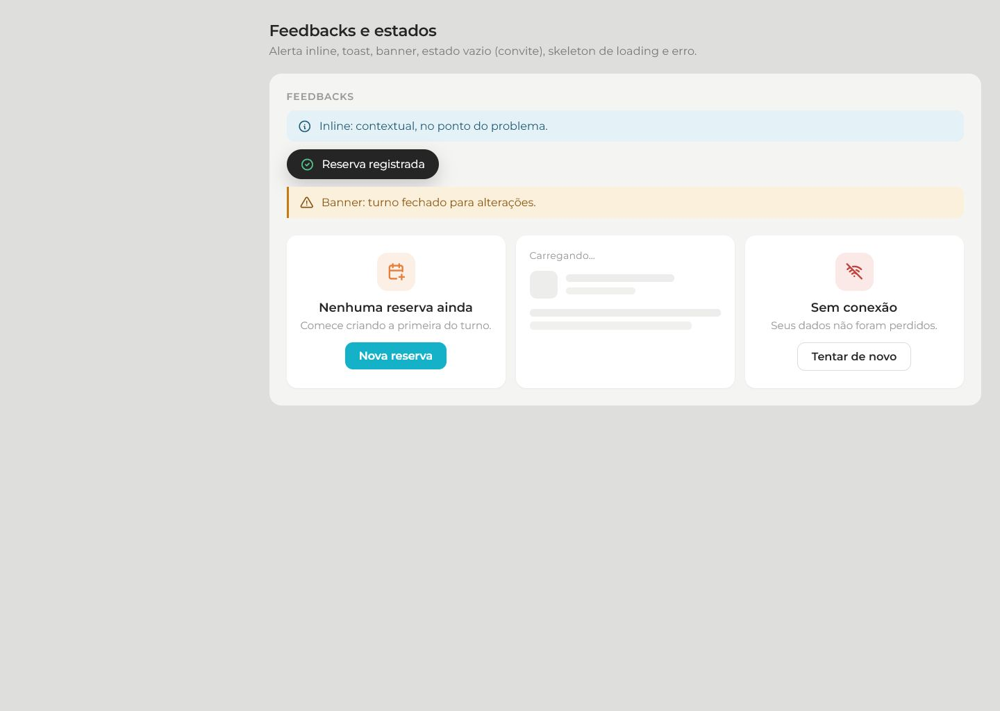

# FBControl — Projeção de Entrega Visual

Documento-base para orientar o retrofit visual completo do FBControl e servir como parâmetro objetivo de aceite no fim do processo.

Este material não descreve apenas "inspiração". Ele define como o sistema deverá parecer, se comportar e organizar informação quando a entrega visual estiver concluída.

## Objetivo

Levar o FBControl de uma interface híbrida (parte nova, parte herdada) para um app operacional consistente, moderno, rastreável e denso o suficiente para uso real em A&B.

Ao final do processo, o sistema deverá transmitir quatro coisas com clareza:

1. Controle operacional.
2. Leitura rápida.
3. Hierarquia visual estável.
4. Coerência entre desktop, tablet e mobile.

## Decisões de direção

Estas são as decisões que passam a valer como orientação principal da entrega:

1. Desktop usará `topnav` como navegação principal.
   Motivo: o shell atual funciona melhor horizontalmente do que com uma rail lateral fixa; reduz conflitos de largura e melhora tablet.

2. Tablet e mobile usarão navegação inferior + offcanvas contextual.
   Motivo: mantém alcance de polegar e reduz desperdício de largura útil.

3. Não haverá "hero card" como padrão de página.
   Motivo: o FBControl é ferramenta operacional, não landing page interna.

4. Cards existirão apenas quando houver conteúdo repetido, detalhe, agrupamento ou ação real.
   Motivo: evitar inflar a tela com caixas desnecessárias.

5. Cor será semântica.
   Laranja = marca.
   Ciano = ação.
   Cor de restaurante = identidade operacional.
   Cores de status = semântica pura.

6. Todo dado importante deve ter apoio visual.
   Exemplo: ocupação, capacidade, risco, progresso, status.

## O que será considerado "entrega final"

O retrofit visual só será considerado concluído quando o sistema atender aos pontos abaixo:

1. Um único vocabulário visual estiver governando a aplicação.
2. O shell desktop/mobile estiver estabilizado.
3. As telas principais de operação, reservas, análise e relatórios seguirem o mesmo idioma visual.
4. Modais, detalhes, formulários e feedbacks tiverem padrão único.
5. A leitura no mobile/tablet não depender de zoom, arrasto lateral ou improviso visual.

## Referência 1 — Navegação responsiva

Esta imagem representa a lógica final de navegação entre desktop, tablet e mobile.

### O que esta referência fixa

1. Desktop com navegação superior limpa e conteúdo centralizado.
2. Tablet/mobile com navegação inferior funcional.
3. Ação principal visível e contextual.
4. Menos peso estrutural na navegação, mais foco no conteúdo.

## Referência 2 — Reserva e painel de detalhes

Esta imagem representa como reservas temáticas e detalhes operacionais devem ser apresentados.

### O que esta referência fixa

1. Reserva com identidade forte e leitura imediata.
2. Badges com função real, não decorativa.
3. Separação clara entre dados principais e observações.
4. Painel de detalhe estruturado, sem aparência de modal legado.

## Referência 3 — Header, resumo e listagem

Esta imagem representa o padrão final para páginas de gestão, dashboards, relatórios e módulos administrativos.

### O que esta referência fixa

1. Cabeçalho enxuto com título, subtítulo e ação principal.
2. Resumo em blocos visuais curtos.
3. Listagens com cara de app operacional, não de planilha crua.
4. Hierarquia forte entre informação principal e secundária.

## Referência 4 — Feedbacks e estados do sistema

Esta imagem representa o comportamento visual esperado para alertas, vazios, skeletons e confirmações.

### O que esta referência fixa

1. Sucesso como confirmação clara e visível.
2. Erro com destaque suficiente para não passar despercebido.
3. Estado vazio orientando a próxima ação.
4. Loading com estrutura previsível.

## Aplicação por área

### 1. Shell global

Entrega esperada:

1. `topnav` desktop definitiva.
2. `bottom nav` funcional em telas menores.
3. Conteúdo centralizado com largura controlada.
4. Sem duplicidade entre navegação lateral e superior.

### 2. Reservas temáticas

Entrega esperada:

1. Fluxo em etapas visuais claras.
2. Grade de turnos densa e legível.
3. Painel de cadastro assistido com melhor prioridade visual.
4. Grupos claramente agrupados em detalhes, conferência e impressão.
5. Modais e folhas com leitura forte em mobile.

### 3. Operação temática

Entrega esperada:

1. Turnos e ocupação com leitura instantânea.
2. Listas de reservas com agrupamento consistente.
3. Detalhes de reserva com blocos visuais limpos.
4. Menos cara de formulário antigo, mais cara de painel operacional.

### 4. Dashboards e análise

Entrega esperada:

1. Header padronizado.
2. KPIs com apoio visual.
3. Filtros acessíveis sem poluir o topo.
4. Tabelas substituídas por listagens mais densas quando fizer sentido.

### 5. Administração

Entrega esperada:

1. Cadastros mais limpos.
2. Listagens administrativas menos tabeladas.
3. Edição via popup/painel estruturado quando apropriado.
4. Melhor comportamento em tablet e mobile.

## Critérios de aceite visual

No final, o sistema deverá passar por este checklist:

1. Não parecer um conjunto de telas independentes.
2. Não misturar linguagens antigas e novas no mesmo fluxo.
3. Não usar caixas excessivas só para "segmentar".
4. Não exigir arrasto lateral em resolução operacional comum.
5. Não depender de tabela crua em fluxos críticos.
6. Não esconder ação primária.
7. Não deixar feedback pequeno ou fácil de perder.
8. Não exigir interpretação excessiva para reservas, status, lotação ou contexto.

## Ordem recomendada de retrofit

Para manter consistência, a execução visual deve seguir esta ordem:

1. Design system base: tokens, elevação, espaçamento, motion.
2. Shell global: topnav, bottom nav, largura, respiro, summary bar.
3. Reservas temáticas.
4. Operação temática.
5. Dashboards e análise.
6. Relatórios.
7. Administração.
8. Login e telas auxiliares.

## Regra final

Este documento passa a ser a referência de comparação visual do projeto.

Toda tela retrabalhada deve responder a duas perguntas:

1. Ela se aproxima destas referências?
2. Ela melhora leitura e operação sem introduzir peso visual desnecessário?

Se a resposta for "não", a tela ainda não está pronta.
